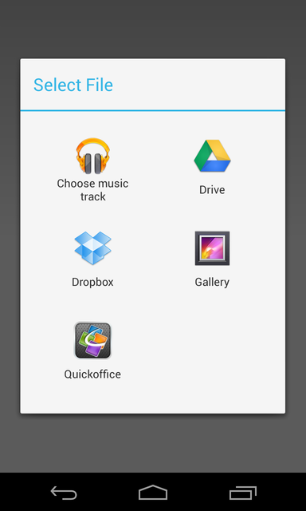

Cordova FileChooser Plugin

Requires Cordova >= 2.8.0

Install with Cordova CLI
	
	$ cordova plugin add https://github.com/adilJad/cordova-filechooser.git

API

	fileChooser.open(successCallback, failureCallback);

The success callback get the uri of the selected file

	fileChooser.open(function(data) {
		alert(uri);
	});
	
where data

	data = {
		size: //file size
		name: //file name
		file: //Base64 code
		type: // file type i.e "application/pdf"
	}
	
Screenshot

TODO rename `open` to pick, select, or choose.
